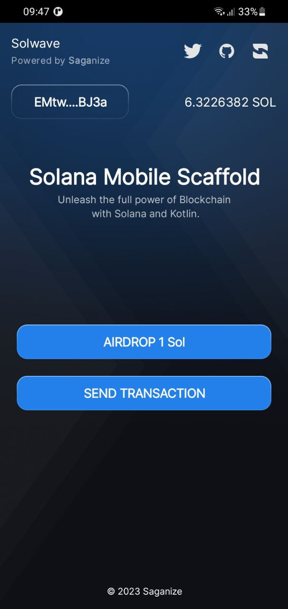
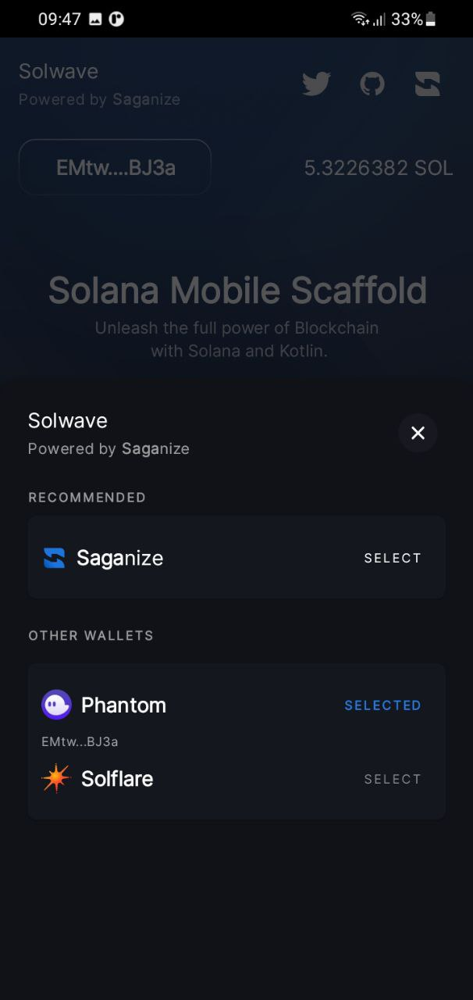

# Kotlin dApp Scaffold
This is a repository template providing a fast and efficient way for developers to build decentralized Mobile applications on the Solana Blockchain. The Scaffold includes pre-built components integrated with features, such as Wallet connection, Airdrop SOL, and Sign and Send transactions.

## 🛠️ Getting Started

To start using Scaffold, follow the below steps:
1. **Use Repository**:
- Click on "Use this template" dropdown.
- Select "Create a new repository".
- Clone the repository to your local device using `git clone <repository-url>` command.
2. **Obtain Your API Key**: 
- Visit our Dashboard to acquire your unique API_KEY. Not sure how to get started? Follow our [guide](https://docs.saganize.com/get-started/dashboard) for step-by-step instructions on obtaining your API key. 
- Replace this `YOUR_API_KEY` in `App.kt` file, [here](https://github.com/Saganize/kotlin-dapp-scaffold/blob/890646d39654f5e27238e6327ff420206788c87b/sample/src/main/java/com/saganize/solwave/sample/App.kt#L52)
3. **Firebase Configuration**: 
- Get the Firebase configuration file for your project. This step is crucial for enabling advanced features and functionalities within the Solwave SDK. For assistance, [follow the steps mentioned and get and download the Firebase Configuration file](https://firebase.google.com/docs/android/setup#console). 
- Also, it is important to enable [Firebase Authentication for Google Sign In](https://firebaseopensource.com/projects/firebase/quickstart-android/auth/readme/) and re-import the `google-services.json` file.

You can now run the app and test out the Mobile Scaffold. 

## 📲 Screenshots

<table>
  <thead>
    <tr>
      <th><h3>Home</h3></th>
      <th><h3>Select Wallet</h3></th>
      <th><h3>Send Transaction</h3></th>
    </tr>
  </thead>
  <tbody>
  <tr>
    <td></td>
    <td></td>
    <td></td>
  </tr>
    </tbody>
</table>

## 👨‍💻 Contributing

- Any contributions you make to this project is **greatly appreciated**.

## 👾 Bug / Feature Request

If you find a bug in the app, kindly open an issue [here](https://github.com/Saganize/kotlin-dapp-scaffold/issues/new?assignees=&labels=bug&template=bug_report.md&title=%5BBug%5D%3A+) to report it by
including a proper description of the bug and the expected result. 

[Feature requests](https://github.com/Saganize/kotlin-dapp-scaffold/issues/new?assignees=&labels=enhancement&template=feature_request.md&title=%5BFeature+Request%5D%3A+) are appreciated too. If you feel like a certain feature is missing, feel free to create an issue to discuss with the maintainers.
